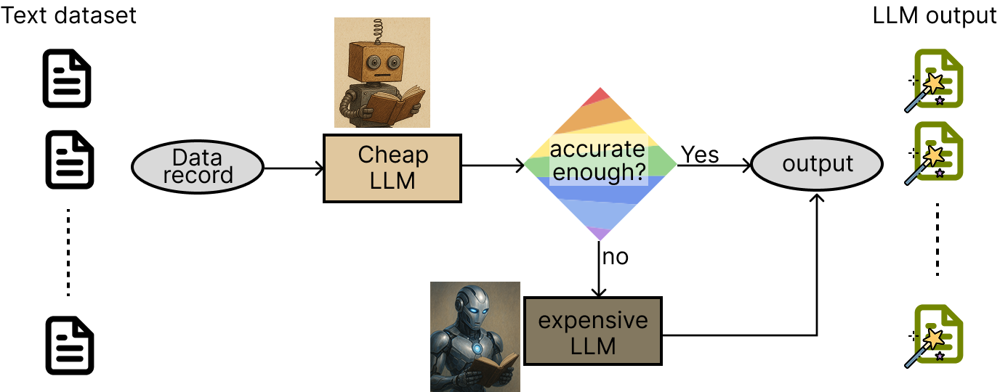
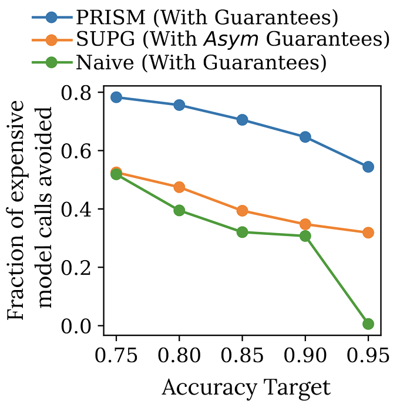

# <picture>  <source media="(prefers-color-scheme: dark)" srcset="images/title_dark.png" width="650" alt="BARGAIN: Guaranteed Accurate AI for Less"> <source media="(prefers-color-scheme: light)" srcset="images/title_light.png" width="650" alt="BARGAIN: Guaranteed Accurate AI for Less">  </picture>


BARGAIN helps reduce cost when processing a dataset using LLMs. It automatically decides when to use a cheap and potentially inaccurate LLM, or an expensive but accurate LLM when processing the data, while providing accuracy guarantees. It maximizes how often the cheap LLM is used while guaranteeing the answer matches the expensive LLM's output based on a user-provided accuracy requirement.  


---

## Table of Contents
- [Overview](#overview)
- [Why BARGAIN?](#why-bargain)
- [Installation](#installation)
- [Getting Started](#getting-started)
- [Examples](#examples)
  - [Color or Animal?](#color-or-animal)
  - [Extract Animal Name](#extract-animal-name)
  - [US Supreme Court Opinion](#supreme-court-opinion)
- [Defining LLMs to Use](#defining-llms-to-use)
- [Precision and Recall Targets](#precision-and-recall-targets)

---

## Overview
BARGAIN follows the _model cascade_ framework. To process a data record with an LLM given a prompt, it first runs the cheap model on the data record. Based on the model's output logprobabilities it decides whether to trust the cheap model or not. If it decides the cheap model's output is inaccurate, it then runs the more expensive model. 

<p align="center">

</p>

To decide whether to trust the cheap model, BARGAIN uses a _cascade threshold_: if the cheap model's output logprobability is more than the cascade threshold, BARGAIN uses the cheap model's output. This cascade threshold is determined in a preprocessing step to provide theoretical guarantees. 

Given an accuracy target `T`, **BARGAIN guarantees the output matches the expensive model's output at least on T% of the documents, but uses the cheap model on as many records as possible.** This guarantee is achieved through sampling and labeling a few records during preprocessing to estimate a suitable cascade threshold. 

---

## Why BARGAIN?
BARGAIN reduces costs while providing theoretical guarantees, unlike systems such as [FrugalGPT](https://arxiv.org/abs/2305.05176) that don't provide any guarantees. Other approaches, such as [SUPG](https://arxiv.org/abs/2004.00827), provide weaker guarantees and worse utility: they use the expensive LLM much more than needed to provide a weaker accuracy guarantee than BARGAIN. SUPG's guarantees only hold asymptotically and in the limit but BARGAIN's hold for any sample size. BARGAIN provides these benefits through an improved sampling process (BARGAIN performs adaptive sampling) and better estimation of the LLM's accuracy (BARGAIN uses [recent statistical tools](https://arxiv.org/abs/2010.09686) for estimation). 

The figure below shows our experimental study comparing SUPG with BARGAIN across 8 different real-world datasets. The results show the fraction of expensive LLM calls avoided, averaged across the datasets. The figure also shows a naive method that provides the same guarantees as BARGAIN with a naive sampling and estimation process (using uniform sampling and Hoeffding's inequality for estimation). BARGAIN reduces cost significantly more than both baselines.  

<p align="center">

</p>

---

## Installation
To install BARGAIN, run
```bash
pip install ai-prism
```
BARGAIN uses `numpy`, `pandas`, `tqdm`, and `openai` libraries. The `openai` library is optional and can be replaced with other service providers.

---

## Getting Started
Assume you have a dataset you want to process using LLMs with a specific prompt. We consider a toy example here:
```python
data_records = ['zebra', 'monkey', 'red', 'blue', 'lion', 'black']
task = "Does the text '{}' mention an animal? Respond only with True or False."
```
`data` is a list of strings and `task` is a templatized string. Our goal is to prompt an LLM with `task.format(data_records[i])` for all `i` to obtain whether each data item is an animal or a color.

We use BARGAIN to do so with OpenAI models. OpenAI provides `gpt-4o` and `gpt-4o-mini` for processing. BARGAIN automatically decides which one to use, while guaranteeing the output matches gpt-4o based on a user-provided accuracy requirement. 

To use BARGAIN, first import
```python
from BARGAIN import OpenAIProxy, OpenAIOracle, BARGAIN_A
```
BARGAIN refers to the cheap but potentially inaccurate model as _proxy_ and to the expensive but accurate model as _oracle_. Here, for OpenAI models, `gpt-4o` is our oracle and `gpt-4o-mini` is our proxy. We first define them below
```python
proxy = OpenAIProxy(task, model='gpt-4o-mini', is_binary=True)
oracle = OpenAIOracle(task, model='gpt-4o', is_binary=True)
```
`task` is the templatized string defined above, `model` is the name of the model to use and `is_binary` denotes whether the task is a binary classification task (as is in our case). You can use BARGAIN for non-binary classification or open-ended tasks as well, see [this example](#extract-animal-name).   
> **Note:** If you set `is_binary=True` you should instruct the model in your `task` prompt to only provide `True` or `False` outputs.

Then, to use BARGAIN, run:
```python
bargain = BARGAIN_A(proxy, oracle, target=0.9, delta=0.1)
res = bargain.process(data_records)
```
`BARGAIN_A` is the main class used for processing (`A` stands for accuracy, see [here](#precision-and-recall-targets) when considering precision or recall metrics). 
- `target=0.9` means 90% of outputs must match those of the oracle.
- `delta=0.1` allows a 10% chance the statistical guarantee may fail.
  
Calling `bargain.process(data_records)` processes the data and returns a list, with `len(res)=len(data_records)` and `res` contains the LLM output for each data record. 

---

## Examples
[examples](main/examples) folder contains multiple example use-cases. _Run examples from the examples directory_.

> **Note:** To run the examples, you must set your OpenAI API key. 
## Color or Animal?
This is an extension of the toy example discussed above. Run
```bash
python toy_dataset_color_or_animal.py
```
The example generates a synthetic dataset containing color or animal names, and asks the LLMs to decide whether there a record mentions an animal or not. You will get the output`
```
Accuracy: 0.95, Used Proxy: 0.45
```
This means BARGAIN used the proxy (i.e., `gpt-4o-mini`) to process 45% of the records, but the output matches the oracle's output (i.e., `gpt-4o`) on 95% of the records. 

### Extract Animal Name
This example uses BARGAIN for an open-ended task. It generates a dataset where each record consists of a description of color theory, but an animal name is inserted in the middle of the text. The task for the LLM is to extract the animal name. Run
```bash
python toy_dataset_extract_animal.py
```
We obtain
```
Accuracy: 1.0, Used Proxy: 0.57
```
This means BARGAIN used the proxy (i.e., `gpt-4o-mini`) to process 57% of the records, but the output matches the oracle's output (i.e., `gpt-4o`) on 100% of the records. 

### Supreme Court Opinion
This is an example on a real-world dataset, obtained from https://www.courtlistener.com/. Each record in [the dataset](examples/court_opinion.csv) consists of a written Supreme Court opinion, and the task is to determine whether the opinion reverses a lower court ruling. Run 
```bash
python court_opinion_example.py
```
We obtain
```
Accuracy: 0.976, Used Proxy: 0.406
```
This means BARGAIN used the proxy (i.e., `gpt-4o-mini`) to process 40.6% of the records, but the output matches the oracle's output (i.e., `gpt-4o`) on 97.6% of the records. 

---

## Defining LLMs to Use
To use non-OpenAI service providers, or specify your own model calling mechanism even for OpenAI models, you can define your own models. You need to define a `Proxy` and an `Oracle`. `Proxy` is a cheap but potentially inaccurate model you want to use as much as possible, and `Oracle` is the expensive and accurate model whose answers you trust. To do so you need to extend the `Proxy` and `Oracle` classes as follows. First, consider `Proxy`:
```python
from BARGAIN import Proxy

class YourProxy(Proxy):
    def __init__(self, task:str):
        super().__init__()
        self.task = task

    def proxy_func(self, data_record: str) -> Tuple[Any, float]:
        # Write your LLM call here that applies prompt self.task to data_record and
        # Generates an output and confidence score (i.e., logprobabilities). Something like:
        output, confidence_score = CheapLLMCall(self.task, data_record)
        return output, confidence_score
```
The above class extends `Proxy` class and defines its own `proxy_func`. This function processes an input `data_record` with a desired cheap LLM. It produces an `output` which is the cheap LLM's output on `data_record`, and a `confidence_score` that can be computed from logprobabilities of the LLM. We next define an `Oracle`:

```python
from BARGAIN import Oracle

class YourOracle(Oracle):
    def __init__(self, task:str):
        super().__init__()
        self.task = task

    def oracle_func(self, data_record: str, proxy_output) -> Tuple[bool, any]:
        # Write your LLM call here that applies prompt self.task to data_record and
        # Generates an output. The output is also used to validate if proxy_output is correct. Something like:
        oracle_output = ExpensiveLLMCall(self.task, data_record)
        proxy_is_correct = oracle_output == proxy_output
        # In open-ended settings, you can use LLM as a judge to avoid the equality check above
        # That is, use LLM as a judge to check if proxy_output is correct, and if not, provide the correct answer

        return proxy_is_correct, oracle_output 
```
The above class extends `Oracle` class and defines its own `oracle_func`. This function processes an input `data_record` with an accurate LLM. It evaluates whether the given `proxy_output` is correct, and also returns the correct answer. The user-defined proxy and oracle can be used by BARGAIN as before:
```python
proxy = YourProxy(task)
oracle = YourOracle(task)
bargain = BARGAIN_A(proxy, oracle, target=0.9, delta=0.1)
res = bargain.process(data)
```
See our [OpenAI models](BARGAIN/models/GPTModels.py) as examples of defining your proxy and oracle.


---

## Precision and Recall Targets
For binary classification tasks, BARGAIN also supports specifying a desired precision or recall on the output. BARGAIN returns a set of indexes of records estimated to have a positive label, and the precision or recall of this set matches the user-specified requirement with high probability. Usage is similar to before, but now we use `BARGAIN_R` and `BARGAIN_P` classes to specify recall and precision targets, respectively. For example
```python
bargain = BARGAIN_P(proxy, oracle, delta, target, budget)
est_positive_indx = bargain.process(data)
```
In this setting BARGAIN additionally takes a pre-specified `budget` as input. It performs at most `budget` number of oracle calls, but returns an output with _precision_ at least `target` with probability at least `1-delta` with the goal of maximizing _recall_. If given a recall target:
```python
bargain = BARGAIN_R(proxy, oracle, delta, target, budget)
est_positive_indx = bargain.process(data)
```
BARGAIN performs at most `budget` number of oracle calls, but returns an output with _recall_ at least `target` with probability at least `1-delta` with the goal of maximizing _precision_. 

> **Note:** If you specify your own `Proxy` and `Oracle`, both proxy and oracle outputs must be boolean to use `BARGAIN_R` or `BARGAIN_P`.


